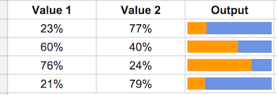
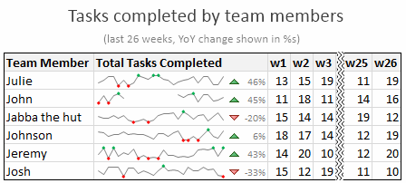
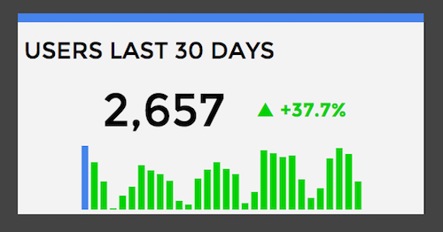
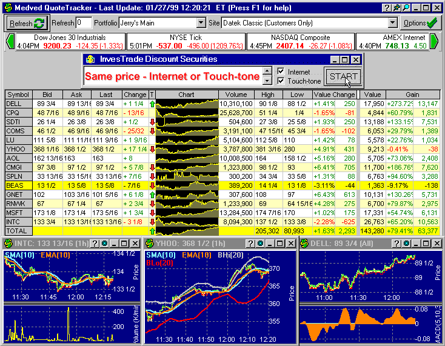
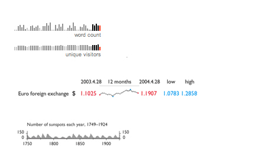
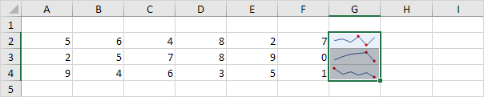
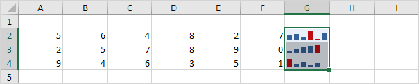
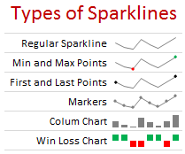
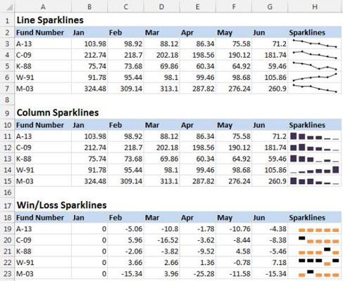
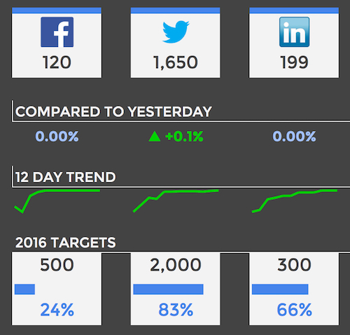

# Visualisation interactive de données (MOS 5.5)

## Cours 1

### Workbooks de Tableau

https://public.tableau.com/profile/javier.antuna.gonzalez7639#!/

### Sparkline

#### Définition

Un sparkline, aussi appelé mini-graphique ou graphique en ligne, est un très petit graphique, généralement dessiné sans axes, coordonnées, légendes, titres ou d'autres éléments spécifiques au diagramme. Ce graphique miniature propose une représentation visuelle des données sous une forme de variation ou changement général des données d'une manière simple et condensée pour illustrer les hauts, les bas et les tendances.

<table border="0">
  <tr>
    <td>
      
    </td>
  </tr>
</table>

<table border="0">
  <tr>
    <td>
      
    </td>
  </tr>
</table>

La différence entre un graphique et un sparkline est qu'un graphique typique se comporte comme un élément de bloc conçu pour montrer autant de données que possible. En revanche, les graphiques sparkline sont plus petits et ils sont destinés à être affichés à l'intérieur de une cellule de la feuille de calcul, dans le texte ou près ses données.

<table border="0">
  <tr>
    <td>
      
    </td>
  </tr>
</table>

#### Historique

Le concepteur des sparklines a été Peter Zelchenko. Il les a créé en 1998 pour la plate-forme de négociation PC Medved QuoteTracker, en utilisant l'expression *graphique en ligne* au lieu de *sparkline*.

<table border="0">
  <tr>
    <td>
      
    </td>
  </tr>
</table>

Le mot *sparkline* a été inventé par le statisticien et le spécialiste de la visualisation des données Edward Tufte. Il a introduit ce terme dans son livre *Beautiful Evidence* pour faire référence à des *"graphismes intenses, faciles à concevoir, de la taille de mots"*.

<table border="0">
  <tr>
    <td>
      
    </td>
  </tr>
</table>

En 2008, Microsoft décide de mettre en place les sparklines dans son nouveau produit Microsoft Excel 2010. Maintenant, sparklines est un add-on gratuit qui permet de construire des mini graphiques dans les mêmes cellules Excel. Cette fonctionnalité peut aussi être ajoutée à Excel 2003 et Excel 2007 à l'aide d'un module spécifique.

<table border="0">
  <tr>
    <td>
      
    </td>
  </tr>
</table>

<table border="0">
  <tr>
    <td>
      
    </td>
  </tr>
</table>

#### Variantes

Le sparkline permet de configurer de nombreux aspects dans la conception des graphiques, pouvant sélectionner différents types (barres, ligne ascendante et descendante, graphique sous forme de fromage circulaire, par portions, etc.).

<table border="0">
  <tr>
    <td>
      
    </td>
  </tr>
</table>

<table border="0">
  <tr>
    <td>
      
    </td>
  </tr>
</table>

#### Commentaires personnels

Je trouve qu'il existe une grande limitation quand on veut afficher plusieurs informations en même temps parce qu'on ne possède le space suffisant pour les montrer. Donc, ils ne sont pas très utiles pour faire des grosses analyses de données. En plus, un sparkline ne sert pas à afficher des graphiques qui possèdent différentes dimensions ou mesures ni pour les graphiques en 3D.

Par contre, il me semble qu'un sparkline est une bonne représentation visuelle pour mieux comprendre le comportement des données qui sont proches au sparkline et il est probablement un des meilleurs façons d'expliquer les données de manière graphique dans un petit space.

<table border="0">
  <tr>
    <td>
      
    </td>
  </tr>
</table>

#### Sources

* Use sparklines to show data trends: https://support.office.com/en-us/article/use-sparklines-to-show-data-trends-1474e169-008c-4783-926b-5c60e620f5ca

* What is sparkline?: http://searchbusinessanalytics.techtarget.com/definition/sparkline

* Utiliser des graphiques sparkline pour afficher les tendances des données: https://support.office.com/fr-fr/article/utiliser-des-graphiques-sparkline-pour-afficher-les-tendances-des-donn%C3%A9es-1474e169-008c-4783-926b-5c60e620f5ca

* Sparklines - mini gráficos en celdas - TodoExcel: https://www.todoexcel.com/sparklines-mini-graficos-en-celdas/

* SPARKLINE - Docs editors Help - Google Support: https://support.google.com/docs/answer/3093289?hl=en

* Sparkline - Wikipedia: https://en.wikipedia.org/wiki/Sparkline

* Sparkline charts | Highcharts: https://www.highcharts.com/demo/sparkline

* What is sparkline? - Definition from WhatIs.com: http://searchbusinessanalytics.techtarget.com/definition/sparkline

## Cours 2

### Graphique scatterplot (Block Builder)

http://blockbuilder.org/javierantuna/e80286b5569e7cc3c725fbf9bf724e81

### Projet *EuroTurismVis*

https://github.com/javierantuna/EuroTurismVis
